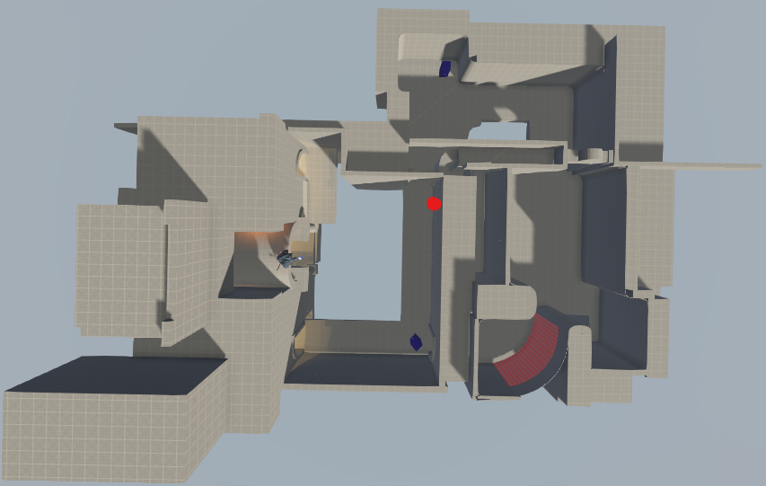

# Reflex Map Center
A command line application to shift all brushes and entities in a Reflex Arena .map file such that the geometric center of the map is aligned to the three-dimensional origin.\
***Author:*** *Mauro Merconchini*

## Getting Started
Everything you will need to get the application up and running.

### Prerequisite
**Java 1.6.0 or above.** If you don't have it already, you can [download it here](https://www.java.com/en/download/)

### Installation
Download the [latest release](https://github.com/mauro-merconchini/ReflexMapCenter/releases) and unzip the contents into a directory of your choosing.

**Note:** Please **don't** rename any of the directories, executables, or mess with the file structure in any way. Doing so will very likely cause the program to not function, as it will not be able to locate files during execution.

## How to Use
After placing a *Reflex Arena* **.map** file in the same directory as the executable, you can center it by running the application in the command line. The syntax is as follows:

```
ReflexMapCenter <myMap>.map
```

The resultant map file will be placed in the same directory as the input **.map** file have the following nomenclature:

```
<myMap>.map ---> <myMap>_Centered.map
```

## Why Is This Useful?
When you are building a map in *Reflex Arena*, you will seldom be concerned with what is the distance of your map geometry and entities from the origin of the three-dimensional space. For example, the red dot marks the geometric center of the map:



However, upon closer inspection you can see that the geometric center of the map is not aligned with the origin of the three-dimensional world, as shown below:


This tool will seek to make the geometric center of your map align itself with the origin of the three-dimensional game space, either exactly or by the nearest integer unit.

## Built With
* [Launch4j](http://launch4j.sourceforge.net/) - A cross-platform Java executable wrapper

## Tools
I developed my own set of tools for shifting the brushes and entities of *Reflex Arena* maps, and they are bundled with this application to perform the map centering. If you'd like to learn more about these tools individually, have a look at their individual repositories:
* [Reflex Brush Shifter](https://github.com/mauro-merconchini/ReflexBrushShifter)
* [Reflex Entity Shifter](https://github.com/mauro-merconchini/ReflexEntityShifter)

## Acknowledgements
* *lolograde* from the [Reflex Arena discord](https://discordapp.com/invite/reflex) for inpiring me to make this tool
* Mikhail for suggesting the easiest way to find the geometric center of the map

## License
This project is licensed under the MIT License - see the [LICENSE.md](LICENSE.md) file for details